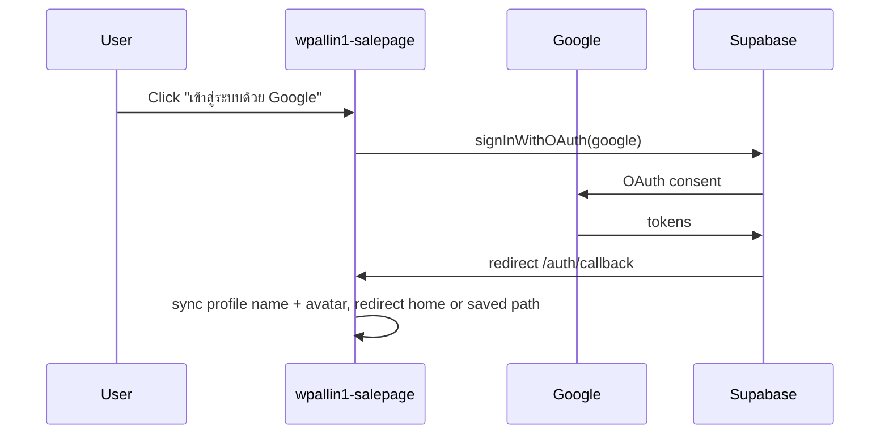

# Google Sign-In — wpallin1-salepage

Google login uses **Supabase Auth OAuth** (not Lovable cloud-auth) so it works on Vercel production.

เข้าสู่ระบบด้วย Google ใช้ Supabase OAuth โดยตรง — ใช้งานได้บน Vercel

## App flow



| Route               | Role                                       |
| ------------------- | ------------------------------------------ |
| `/login`, `/signup` | Start OAuth via `signInWithGoogle()`       |
| `/auth/callback`    | PKCE code exchange, sync profile, redirect |

**Post-login redirect:** customers → home (`/`), admins → `/admin`. Optional `?next=/cart` on `/login` or `/signup` returns there after Google OAuth.

**Note:** Google accounts are **email-confirmed automatically** — no `/verify-email` step needed.

## One-time Supabase setup

Dashboard: [Auth Providers — Google](https://supabase.com/dashboard/project/erpzxusskbtdxvqadwxv/auth/providers)

1. Enable **Google**
2. Add **Client ID** and **Client Secret** from Google Cloud Console

## Google Cloud Console

1. [Google Cloud Console](https://console.cloud.google.com/) → APIs & Services → Credentials
2. Create **OAuth 2.0 Client ID** (Web application)
3. **Authorized redirect URIs** (required):

   ```
   https://erpzxusskbtdxvqadwxv.supabase.co/auth/v1/callback
   ```

4. **Authorized JavaScript origins** (optional):

   ```
   https://wpallin1-salepage.vercel.app
   http://localhost:5173
   ```

## Supabase redirect URLs

Dashboard → **Authentication → URL Configuration**

Ensure these are listed (see also [`wp-group-erp/docs/SUPABASE-AUTH-VERCEL-URLS.md`](../../../wp-group-erp/docs/SUPABASE-AUTH-VERCEL-URLS.md)):

```
https://wpallin1-salepage.vercel.app/**
https://wpallin1-salepage.vercel.app/auth/callback
http://localhost:5173/**
http://localhost:5173/auth/callback
```

## Code references

- [`src/lib/auth-post-login.ts`](../src/lib/auth-post-login.ts) — return path + post-login redirect
- [`src/lib/auth-google.ts`](../src/lib/auth-google.ts) — `signInWithGoogle()`, PKCE callback, profile sync
- [`src/routes/auth.callback.tsx`](../src/routes/auth.callback.tsx) — OAuth return handler
- [`src/lib/auth-redirect.ts`](../src/lib/auth-redirect.ts) — callback URL helper

## Troubleshooting

| Symptom                   | Fix                                                                                        |
| ------------------------- | ------------------------------------------------------------------------------------------ |
| Stuck on callback spinner | Ensure Supabase redirect URLs include `/auth/callback`; PKCE uses `exchangeCodeForSession` |
| Redirect to login failed  | Add `/auth/callback` to Supabase redirect URLs                                             |
| `redirect_uri_mismatch`   | Add Supabase callback URL to Google Console                                                |
| Google disabled error     | Enable Google provider in Supabase + add credentials                                       |
| No profile / wallet       | Check `handle_new_user` trigger on `auth.users`                                            |
