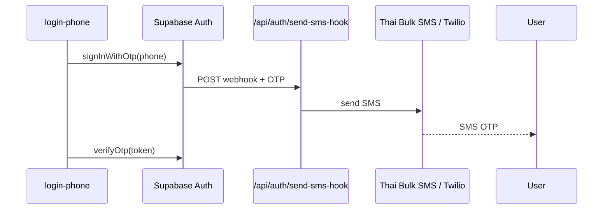

# เชื่อม SMS Provider จริง — WP ALL Salepage

โครงสร้างพร้อมแล้ว — ทำตาม checklist เมื่อพร้อมส่ง OTP จริง

## สถาปัตยกรรม



| ส่วน          | ไฟล์                                    |
| ------------- | --------------------------------------- |
| Hook endpoint | `src/routes/api/auth/send-sms-hook.ts`  |
| Handler       | `src/lib/sms/handle-send-sms.server.ts` |
| Providers     | `src/lib/sms/providers/`                |
| สถานะ         | `GET /api/public/sms-status`            |

---

## Checklist เชื่อมต่อ

### 1. Supabase Dashboard

- [ ] **Authentication → Providers → Phone** → Enable
- [ ] **Authentication → Hooks → Send SMS** → HTTPS
  - URL: `https://wpallin1-salepage.vercel.app/api/auth/send-sms-hook`
  - Generate secret → copy ไป `SEND_SMS_HOOK_SECRET` บน Vercel
- [ ] ปิด built-in Twilio ใน Phone provider ถ้าใช้ Hook แทน

### 2. Vercel env (Production)

```env
SMS_PROVIDER=thai_bulk_sms
SMS_HOOK_PUBLIC_URL=https://wpallin1-salepage.vercel.app/api/auth/send-sms-hook
SEND_SMS_HOOK_SECRET=v1,whsec_...
THAI_BULK_SMS_API_KEY=...
THAI_BULK_SMS_SENDER=WPALL

VITE_PHONE_AUTH_ENABLED=true
VITE_PHONE_AUTH_READY=true
```

### 3. Implement provider API

แก้ไฟล์ `src/lib/sms/providers/thai-bulk-sms.ts`:

- แทน `TODO` ด้วย `fetch()` ไป API จริงของ Thai Bulk SMS
- คืน `{ ok: true, messageId }` เมื่อส่งสำเร็จ

### 4. ทดสอบ

```bash
curl https://wpallin1-salepage.vercel.app/api/public/sms-status
# phoneOtpReady: true เมื่อ configured + hookSecretSet

# ทดสอบ login ที่ /login-phone
```

---

## โหมด stub (ตอนนี้)

| Env                           | พฤติกรรม                                    |
| ----------------------------- | ------------------------------------------- |
| `SMS_PROVIDER=stub` (default) | Hook log OTP ใน server — **ไม่ส่ง SMS**     |
| `VITE_PHONE_AUTH_READY=false` | หน้า login-phone แสดงแบนเนอร์ "กำลังเตรียม" |

Local dev ไม่มี `SEND_SMS_HOOK_SECRET` → verify hook ข้าม (ไม่ใช้ production)

---

## ทางเลือก: Twilio ใน Supabase โดยตรง

ไม่ต้องใช้ Hook ถ้าเลือก Twilio:

1. Supabase → Phone → Twilio credentials
2. ไม่ต้อง deploy `send-sms-hook`
3. ตั้ง `VITE_PHONE_AUTH_READY=true` เมื่อ Twilio ใช้งานได้

---

## อ้างอิง

- [Supabase Send SMS Hook](https://supabase.com/docs/guides/auth/auth-hooks/send-sms-hook)
- [PHONE-OTP-SETUP.md](./PHONE-OTP-SETUP.md)
